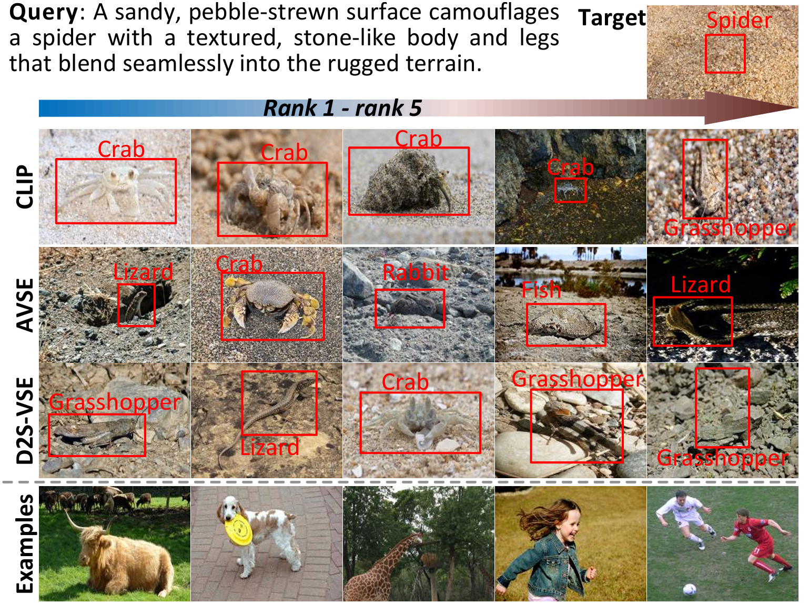
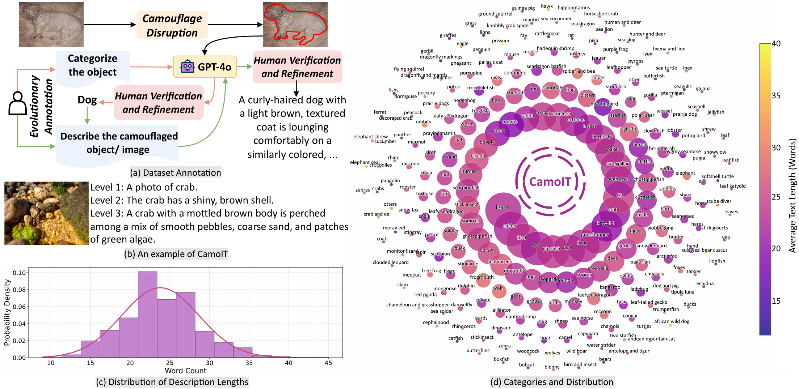
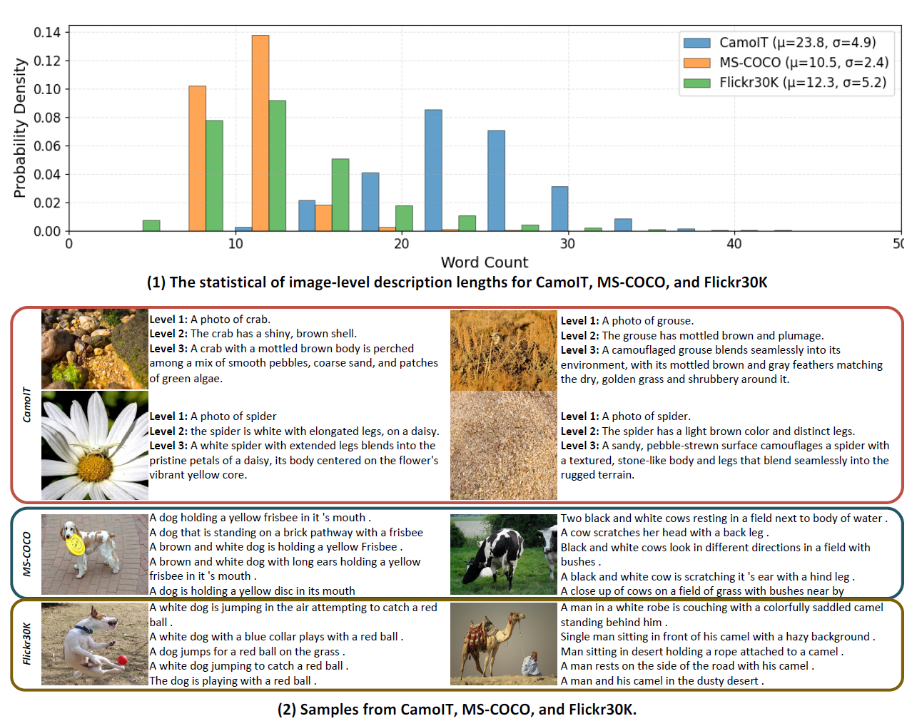
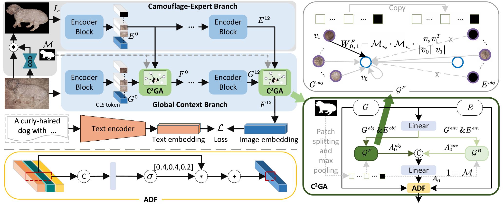
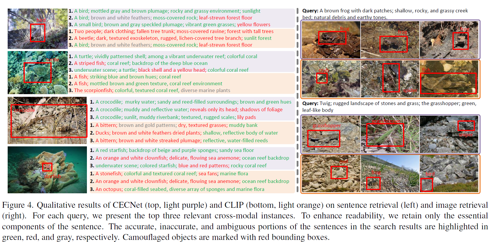

<h1 align="center">Camouflage-aware Image-Text Retrieval</h1>

<h3 align="center">via Expert Collaboration</h3>

<p align="center">
  <a href="#"></a>
  <a href="#"></a>
  <a href="#"></a>
</p>

<p align="center">
  <a href="https://github.com/jiangyao-scu/CA-ITR/stargazers"></a>
  
  
</p>

<p align="center">
  <strong>Yao Jiang</strong><sup>1</sup> · 
  <strong>Zhongkuan Mao</strong><sup>2</sup> · 
  <strong>Xuan Wu</strong><sup>1</sup> · 
  <strong>Keren Fu</strong><sup>1,2,✉</sup> · 
  <strong>Qijun Zhao</strong><sup>1,2</sup>
</p>

<p align="center">
  <sup>1</sup>College of Computer Science, Sichuan University &nbsp;&nbsp; 
  <sup>2</sup>National Key Lab of Fundamental Science on Synthetic Vision
</p>

<p align="center">
  <a href="#-motivation">Motivation</a> • 
  <a href="#-camoit-dataset">Dataset</a> • 
  <a href="#-benchmark">Benchmark</a> • 
  <a href="#%EF%B8%8F-method">Method</a> • 
  <a href="#-results">Results</a>
</p>

<hr>

## 📖 Abstract

<p align="justify">
Camouflaged scene understanding (CSU) has attracted significant attention due to its broad practical implications. However, in this field, robust <strong>image-text cross-modal alignment</strong> remains under-explored. We formulate a new task dubbed <strong>CA-ITR</strong> (Camouflage-aware Image-Text Retrieval) and construct <strong>CamoIT</strong> dataset (~10.5K samples, 237 categories). We propose <strong>CECNet</strong> with a novel <strong>C²GA</strong> mechanism, achieving <strong>~29% overall accuracy boost</strong>.
</p>

---

## 🎯 Motivation

<p align="center">
Current SOTA retrieval models frequently <strong>mismatch</strong> textual descriptions with incorrect visual objects in camouflaged scenes.
</p>

<p align="center">
  
</p>
<p align="center"><i>Figure 1: SOTA retrieval methods fail to correctly match texts with camouflaged objects (red boxes), highlighting the need for CA-ITR. Below the dotted line are samples from the general ITR datasets (i.e., MS-COCO and Flickr30K).</i></p>

---

## 📊 CamoIT Dataset

<p align="center">
  
</p>
<p align="center"><i>Figure 2: Data annotation process, an example, and statistical analyses of CamoIT.</i></p>

<p align="center">
  
</p>
<p align="center"><i>Figure 5: Comparison of CamoIT with MS-COCO and Flickr30K in terms of statistics and sample characteristics.</i></p>

<table align="center">
<tr>
<td width="25%" align="center"><h2>10,464</h2><b>Total Samples</b></td>
<td width="25%" align="center"><h2>~237</h2><b>Categories</b></td>
<td width="25%" align="center"><h2>~25</h2><b>Avg. Words</b></td>
<td width="25%" align="center"><h2>7:3</h2><b>Train/Test Split</b></td>
</tr>
</table>

<p align="center">
  <b>Data Sources:</b> CHAMELEON • CAMO • COD10K • NC4K
</p>

---

## 📈 Benchmark

<h3 align="center">Table 1: Cross-Dataset Evaluation on CamoIT</h3>

<p align="center"><i>Models trained on MS-COCO and Flickr30K, evaluated on CamoIT</i></p>

<table align="center">
<thead>
<tr>
<th rowspan="2" align="center">Method</th>
<th rowspan="2" align="center">Pub.</th>
<th rowspan="2" align="center">FG</th>
<th rowspan="2" align="center">BU</th>
<th colspan="4" align="center">MS-COCO → CamoIT</th>
<th colspan="4" align="center">Flickr30K → CamoIT</th>
</tr>
<tr>
<th colspan="2" align="center">I2T</th>
<th colspan="2" align="center">T2I</th>
<th colspan="2" align="center">I2T</th>
<th colspan="2" align="center">T2I</th>
</tr>
<tr>
<th></th><th></th><th></th><th></th>
<th>R@1</th><th>R@10</th><th>R@1</th><th>R@10</th>
<th>R@1</th><th>R@10</th><th>R@1</th><th>R@10</th>
</tr>
</thead>
<tbody>
<tr>
<td><b>CFM</b></td><td align="center">'22</td><td align="center">✗</td><td align="center">✓</td>
<td align="center">10.7</td><td align="center">26.0</td><td align="center">10.7</td><td align="center">26.7</td>
<td align="center">5.4</td><td align="center">16.5</td><td align="center">6.5</td><td align="center">18.9</td>
</tr>
<tr>
<td><b>HREM</b></td><td align="center">'23</td><td align="center">✗</td><td align="center">✓</td>
<td align="center">11.3</td><td align="center">28.1</td><td align="center">10.5</td><td align="center">27.1</td>
<td align="center">6.7</td><td align="center">19.2</td><td align="center">5.7</td><td align="center">17.9</td>
</tr>
<tr>
<td><b>CHAN</b></td><td align="center">'23</td><td align="center">✓</td><td align="center">✓</td>
<td align="center">10.9</td><td align="center">29.7</td><td align="center">13.2</td><td align="center">30.1</td>
<td align="center">6.9</td><td align="center">20.0</td><td align="center">7.8</td><td align="center">21.7</td>
</tr>
<tr>
<td><b>DBL</b></td><td align="center">'24</td><td align="center">✓</td><td align="center">✓</td>
<td align="center">7.1</td><td align="center">20.0</td><td align="center">8.7</td><td align="center">23.5</td>
<td align="center">4.5</td><td align="center">14.2</td><td align="center">3.7</td><td align="center">13.6</td>
</tr>
<tr bgcolor="#f0f4ff">
<td><b>CUSA</b></td><td align="center">'24</td><td align="center">✗</td><td align="center">✗</td>
<td align="center"><b>15.1</b></td><td align="center"><b>37.0</b></td><td align="center"><b>13.5</b></td><td align="center"><b>35.7</b></td>
<td align="center"><b>12.6</b></td><td align="center"><b>34.0</b></td><td align="center"><b>10.5</b></td><td align="center"><b>27.6</b></td>
</tr>
<tr>
<td><b>LAPS</b></td><td align="center">'24</td><td align="center">✓</td><td align="center">✗</td>
<td align="center">11.8</td><td align="center">29.8</td><td align="center">10.6</td><td align="center">27.3</td>
<td align="center">5.9</td><td align="center">17.2</td><td align="center">4.9</td><td align="center">15.7</td>
</tr>
<tr>
<td><b>AVSE</b></td><td align="center">'25</td><td align="center">✗</td><td align="center">✗</td>
<td align="center">N/A</td><td align="center">N/A</td><td align="center">N/A</td><td align="center">N/A</td>
<td align="center">5.7</td><td align="center">16.0</td><td align="center">4.8</td><td align="center">14.8</td>
</tr>
<tr>
<td><b>D2S-VSE</b></td><td align="center">'25</td><td align="center">✗</td><td align="center">✗</td>
<td align="center">13.3</td><td align="center">33.1</td><td align="center">12.7</td><td align="center">30.9</td>
<td align="center">7.5</td><td align="center">20.9</td><td align="center">6.5</td><td align="center">18.6</td>
</tr>
</tbody>
</table>

<p align="center">
  <b>FG</b>: Local alignment method &nbsp;|&nbsp; 
  <b>BU</b>: Uses BUTD framework &nbsp;|&nbsp; 
  <b>All methods achieve R@1 &lt; 15%</b>
</p>

### 🔍 Key Findings

<p align="center">
Current SOTA retrieval models frequently <strong>mismatch</strong> textual descriptions with incorrect visual objects in camouflaged scenes.
</p>

<table align="center">
<tr>
<td width="33%" align="center">
<h3>🎭 Object Perception</h3>
<p align="center">Camouflaged objects are visually similar to backgrounds</p>
</td>
<td width="33%" align="center">
<h3>🌿 Complex Content</h3>
<p align="center">Images contain intricate backgrounds and multiple elements</p>
</td>
<td width="33%" align="center">
<h3>🔍 Fine-grained Understanding</h3>
<p align="center">Requires detailed comprehension of object attributes</p>
</td>
</tr>
</table>

---

## 🏗️ Method

<h3 align="center">Camouflage-aware Image-Text Retrieval via Expert Collaboration</h3>

<p align="center">
  
</p>
<p align="center"><i>Figure 3: The overall pipeline of the proposed CECNet and C²GA mechanism.</i></p>

<p align="justify">
CECNet employs a dual-branch architecture: the <strong>Global Context Branch</strong> captures holistic scene context, while the <strong>Camouflage Expert Branch</strong> detects camouflaged objects and extracts purified features. The novel <strong>C²GA (Confidence-Conditioned Graph Attention)</strong> mechanism is injected into all 12 transformer layers, which builds separate foreground and background graphs based on COD mask confidence, aggregates features independently to prevent contamination, and fuses them adaptively for robust cross-modal alignment.
</p>

---

## 📉 Results

<h3 align="center">Main Results on CamoIT (Retrained)</h3>

<table align="center">
<thead>
<tr>
<th rowspan="2">Method</th>
<th colspan="3" align="center">Image-to-Text</th>
<th colspan="3" align="center">Text-to-Image</th>
</tr>
<tr>
<th>R@1</th><th>R@5</th><th>R@10</th>
<th>R@1</th><th>R@5</th><th>R@10</th>
</tr>
</thead>
<tbody>
<tr><td>CFM</td>
<td align="center">30.8</td><td align="center">59.9</td><td align="center">70.3</td>
<td align="center">28.9</td><td align="center">57.2</td><td align="center">68.3</td></tr>
<tr><td>HREM</td>
<td align="center">34.3</td><td align="center">62.7</td><td align="center">74.0</td>
<td align="center">31.5</td><td align="center">59.9</td><td align="center">71.4</td></tr>
<tr><td>CUSA</td>
<td align="center">23.9</td><td align="center">53.5</td><td align="center">66.7</td>
<td align="center">23.5</td><td align="center">51.3</td><td align="center">64.3</td></tr>
<tr><td>LAPS</td>
<td align="center">27.8</td><td align="center">62.0</td><td align="center">73.9</td>
<td align="center">28.2</td><td align="center">58.0</td><td align="center">70.7</td></tr>
<tr bgcolor="#f5f5f5"><td><b>D2S-VSE</b></td>
<td align="center">37.1</td><td align="center">68.4</td><td align="center">79.5</td>
<td align="center">35.5</td><td align="center">67.5</td><td align="center">78.4</td></tr>
<tr><td>AVSE</td>
<td align="center">28.1</td><td align="center">59.7</td><td align="center">72.2</td>
<td align="center">26.1</td><td align="center">56.3</td><td align="center">69.7</td></tr>
<tr bgcolor="#f5f5f5"><td><b>CLIP</b></td>
<td align="center">41.3</td><td align="center">69.2</td><td align="center">79.0</td>
<td align="center">41.1</td><td align="center">67.7</td><td align="center">78.4</td></tr>
<tr><td>D2S-VSE+CEC</td>
<td align="center">39.0</td><td align="center">69.4</td><td align="center">81.0</td>
<td align="center">37.0</td><td align="center">68.3</td><td align="center">79.7</td></tr>
<tr><td>AVSE+CEC</td>
<td align="center">29.9</td><td align="center">60.7</td><td align="center">73.6</td>
<td align="center">28.5</td><td align="center">59.2</td><td align="center">71.0</td></tr>
<tr bgcolor="#e8f0ff"><td><b>CECNet (Ours)</b></td>
<td align="center"><b>45.8</b> <sup>+4.5</sup></td>
<td align="center"><b>74.5</b> <sup>+5.3</sup></td>
<td align="center"><b>83.5</b> <sup>+4.5</sup></td>
<td align="center"><b>44.6</b> <sup>+3.5</sup></td>
<td align="center"><b>73.9</b> <sup>+6.2</sup></td>
<td align="center"><b>83.1</b> <sup>+4.7</sup></td></tr>
</tbody>
</table>

<h3 align="center">Qualitative Results</h3>

<p align="center">
  
</p>
<p align="center"><i>Figure 4: Qualitative results of CECNet (top, light purple) and CLIP (bottom, light orange) on sentence retrieval (left) and image retrieval (right).</i></p>

---

## 🔧 Getting Started

<table align="center">
<tr>
<td width="33%" align="center">

### 📦 Pre-trained Models

CLIP ViT-B-32 • ZoomNeXt

<a href="https://drive.google.com/file/d/1Fz3eeqNargYlBi5t_E6tccTACzuybUWq/view?usp=sharing"></a>
<a href="https://pan.baidu.com/s/1EgpEQ8vJDyKfAB1VCGNwzQ?pwd=5tu8"></a>

</td>
<td width="33%" align="center">

### 🎯 Trained Weights

CECNet (Stage 1 & Stage 2)

<a href="https://drive.google.com/file/d/1x0FJsxLnsCKCwrvM_NN7JnytTZZ67xE6/view?usp=sharing"></a>
<a href="https://pan.baidu.com/s/1C42DiM1kSqj-jAJpFHiTkg?pwd=uv9p"></a>

</td>
<td width="33%" align="center">

### 📊 CamoIT Dataset

Images • Annotations • COD Masks

<a href="https://drive.google.com/drive/folders/1QxhhGFeDuPQvu6GXJcLd-pUx8iU9CWp_?usp=sharing"></a>
<a href="https://pan.baidu.com/s/119pGgTt9tqt4AU_rCzSDDw?pwd=xqrx"></a>

</td>
</tr>
</table>

### Installation

```bash
git clone https://github.com/jiangyao-scu/CA-ITR.git
cd CA-ITR

conda create -n cecnet python=3.8
conda activate cecnet

pip install torch torchvision torchaudio
pip install -r requirements.txt
```

### Training

```bash
# Stage 1: Train C²GA (freeze CLIP)
python train.py --output_dir './models/CCGA/' --frozen_clip --ccga_lr 1e-4

# Stage 2: Joint fine-tuning
python train.py --output_dir './models/CECNet/' --ccga_lr 1e-5 --clip_lr 1e-5 \
    --resume_path './models/CCGA/CCGAs.pth'
```

### Evaluation

```bash
# Using pre-computed masks
python test.py --model_path './Path/To/CECNet.pth'

# Using online COD inference
python test.py --model_path './Path/To/CECNet.pth' --Expert
```

---

## 📝 Citation

```bibtex
@article{skurowski2018,
  title={Animal camouflage analysis: Chameleon database},
  author={Skurowski, Przemys{\l}aw and Abdulameer, Hassan and B{\l}aszczyk, Jakub and Depta, Tomasz and Kornacki, Adam and Kozie{\l}, Przemys{\l}aw},
  journal={Unpublished manuscript},
  volume={2},
  number={6},
  pages={7},
  year={2018}
}

@article{le2019,
  author       = {Trung{-}Nghia Le and Tam V. Nguyen and Zhongliang Nie and Minh{-}Triet Tran and Akihiro Sugimoto},
  title        = {Anabranch network for camouflaged object segmentation},
  journal      = {Comput. Vis. Image Underst.},
  volume       = {184},
  pages        = {45--56},
  year         = {2019}
}

@inproceedings{Fan2020,
  author       = {Deng{-}Ping Fan and Ge{-}Peng Ji and Guolei Sun and Ming{-}Ming Cheng and Jianbing Shen and Ling Shao},
  title        = {Camouflaged Object Detection},
  booktitle    = CVPR,
  pages        = {2774--2784},
  year         = {2020}
}

@inproceedings{Lv2021,
  author       = {Yunqiu Lv and Jing Zhang and Yuchao Dai and Aixuan Li and Bowen Liu and Nick Barnes and Deng{-}Ping Fan},
  title        = {Simultaneously Localize, Segment and Rank the Camouflaged Objects},
  booktitle    = CVPR,
  pages        = {11591--11601},
  year         = {2021}
}

@inproceedings{jiang2026cecnet,
  title={Camouflage-aware Image-Text Retrieval via Expert Collaboration},
  author={Jiang, Yao and Mao, Zhongkuan and Wu, Xuan and Fu, Keren and Zhao, Qijun},
  booktitle={CVPR},
  year={2026}
}
```
